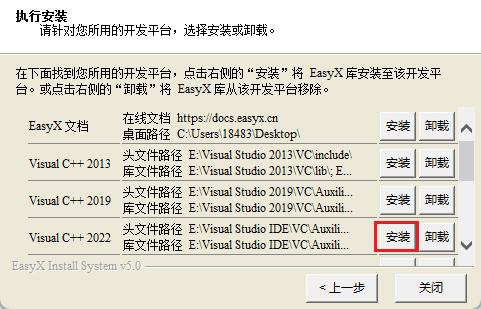
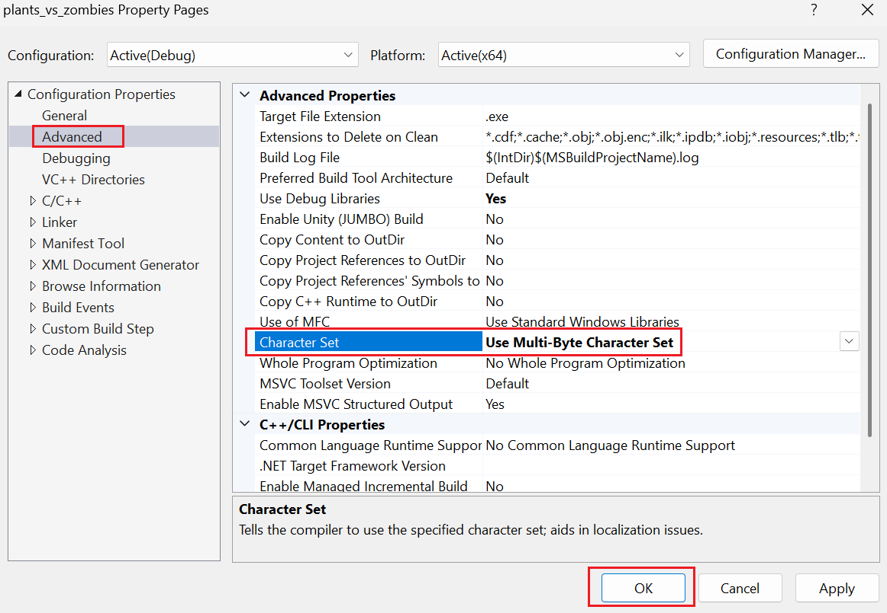
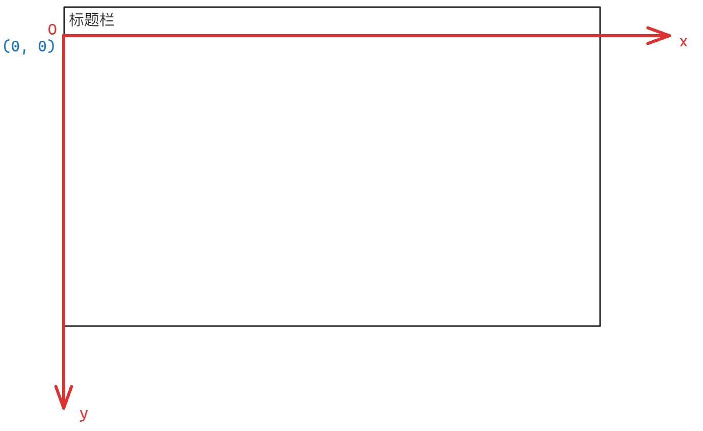
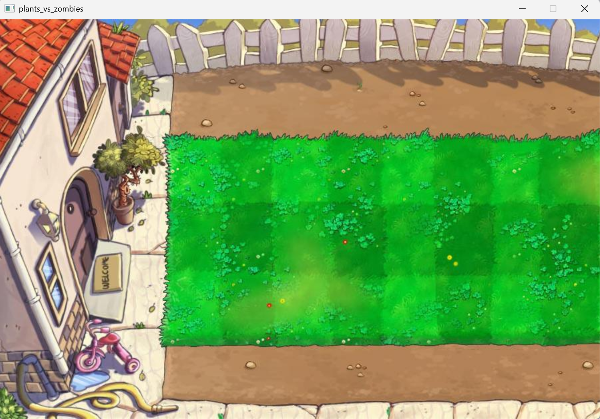
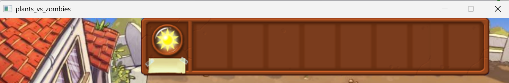
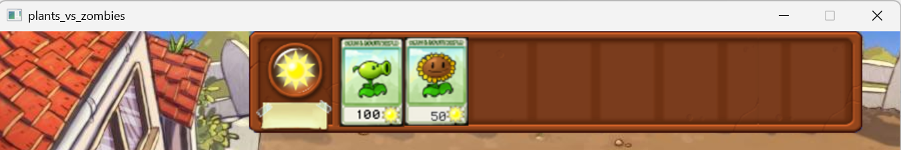
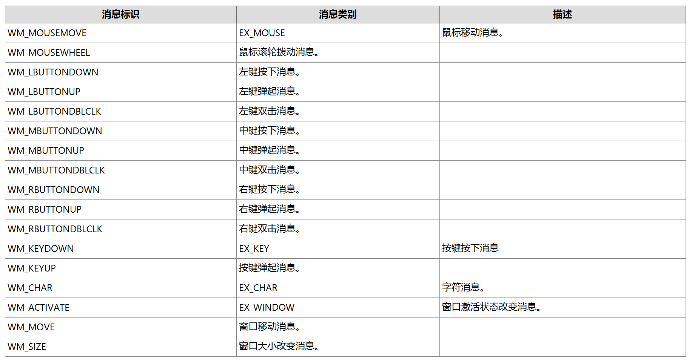
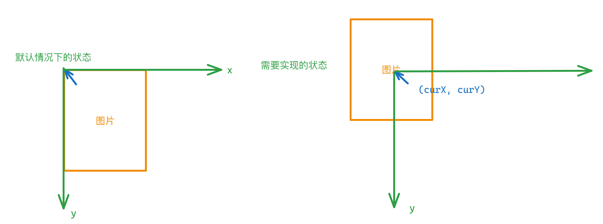

# 【开发文档】植物大战僵尸

## 项目介绍

使用C语言/C++结合Easyx图形库简单模拟植物大战僵尸游戏

## VS2022下的Easyx图形库配置

官网下载Easyx：[EasyX Graphics Library for C++](https://easyx.cn/)

打开安装程序后选择VS2022点击安装即可



## 游戏画面展示

## 项目设计

### 游戏背景初始化

> 需要注意，使用Easyx图形库时，尽管只使用C语言，所有源文件的后缀名都必须是`.cpp`，否则Easyx图形库无法生效

设计思路：

> 使用Easyx图形库需要包含头文件`<graphic.h>`

设计`GameInit()`函数代表游戏开始，首先加载游戏场景背景，因为需要加载背景图片，所以推荐将图片加载到内存由变量接收减少消耗，定义一个全局变量`imgBackground`，在`GameInit()`函数中使用Easyx图形库函数`loadImage()`函数，传入参数`&imgBackground`和图片路径，下面是`loadImage()`函数声明

```c++
// 从图片文件获取图像(bmp/gif/jpg/png/tif/emf/wmf/ico)
void loadimage(
	IMAGE* pDstImg,			// 保存图像的 IMAGE 对象指针
	LPCTSTR pImgFile,		// 图片文件名
	int nWidth = 0,			// 图片的拉伸宽度
	int nHeight = 0,		// 图片的拉伸高度
	bool bResize = false	// 是否调整 IMAGE 的大小以适应图片
);
```

默认情况下后面三个变量不需要修改，并且因为有缺省值，所以可以不需要赋予实参

> 使用`loadImage()`加载图片时，在VS2022中需要更改项目字符集设置为多字节字符集，操作：右键解决方案管理器->属性->项目属性->高级->字符集->多字节字符集->点击OK，如下图所示：
>
> 

```c++
static IMAGE imgBackground;// 游戏场景背景

// 加载图片到变量
loadimage(&imgBackground, "res/bg.jpg");
```

接着绘制显示窗口，使用`initGraph()`函数，传入窗口的宽度和高度，为了方便修改，将宽度和高度使用`#define`定义为常量

下面是`initGraph()`函数的声明：

```c++
HWND initgraph(
	int width, // 宽度
	int height, // 高度
	int flag = NULL
);
```

`flag`为缺省参数，如果需要显示控制台窗口，则传入1，否则传入0或者不传，当前不需要传入参数

```c++
#define WIDTH 900// 游戏窗口宽度
#define HEIGHT 600// 游戏窗口高度

// 启动窗口大小设置
initgraph(WIDTH, HEIGHT);
```

最后显示背景图片，调用`putimage()`函数，传入图片相对于窗口的`x`坐标、`y`坐标以及图片背景变量地址`&imgBackground`

> 对于x坐标和y坐标的计算，参考下图：
>
> 

```c++
// 显示背景图片
putimage(0, 0, &imgBackground);
```

> [!Caution]
>
> 1. `imgBackground`如果作为了全局变量放在头文件中，需要使用`static`关键字修饰，否则会报错为重定义
>
> 2. 防止窗口瞬间关闭，可以在使用下面的代码进行处理
>
>     ```c++
>     system("pause");
>     ```

显示效果：



### 植物选择框设计

因为植物选择框也是一个图片，只需要将该图片叠放在背景图上方即可，需要注意的是，因为植物栏背景有黑边，所以需要处理黑边问题，下面是处理黑边的代码

```c++
// 载入PNG图并去透明部分
void _putimagePNG(int  picture_x, int picture_y, IMAGE* picture) //x为载入图片的X坐标，y为Y坐标
{
	DWORD* dst = GetImageBuffer();    // GetImageBuffer()函数，用于获取绘图设备的显存指针，EASYX自带
	DWORD* draw = GetImageBuffer();
	DWORD* src = GetImageBuffer(picture); //获取picture的显存指针
	int picture_width = picture->getwidth(); //获取picture的宽度，EASYX自带
	int picture_height = picture->getheight(); //获取picture的高度，EASYX自带
	int graphWidth = getwidth();       //获取绘图区的宽度，EASYX自带
	int graphHeight = getheight();     //获取绘图区的高度，EASYX自带
	int dstX = 0;    //在显存里像素的角标

	// 实现透明贴图 公式： Cp=αp*FP+(1-αp)*BP ， 贝叶斯定理来进行点颜色的概率计算
	for (int iy = 0; iy < picture_height; iy++)
	{
		for (int ix = 0; ix < picture_width; ix++)
		{
			int srcX = ix + iy * picture_width; //在显存里像素的角标
			int sa = ((src[srcX] & 0xff000000) >> 24); //0xAArrggbb;AA是透明度
			int sr = ((src[srcX] & 0xff0000) >> 16); //获取RGB里的R
			int sg = ((src[srcX] & 0xff00) >> 8);   //G
			int sb = src[srcX] & 0xff;              //B
			if (ix >= 0 && ix <= graphWidth && iy >= 0 && iy <= graphHeight && dstX <= graphWidth * graphHeight)
			{
				dstX = (ix + picture_x) + (iy + picture_y) * graphWidth; //在显存里像素的角标
				int dr = ((dst[dstX] & 0xff0000) >> 16);
				int dg = ((dst[dstX] & 0xff00) >> 8);
				int db = dst[dstX] & 0xff;
				draw[dstX] = ((sr * sa / 255 + dr * (255 - sa) / 255) << 16)
					| ((sg * sa / 255 + dg * (255 - sa) / 255) << 8)
					| (sb * sa / 255 + db * (255 - sa) / 255);
			}
		}
	}
}

// 适用于 y <0 以及x<0的任何情况
void putimageForPNG(int x, int y, IMAGE* picture) {

	IMAGE imgTmp, imgTmp2, imgTmp3;
	int winWidth = getwidth();
	int winHeight = getheight();
	if (y < 0) {
		SetWorkingImage(picture);
		getimage(&imgTmp, 0, -y,
			picture->getwidth(), picture->getheight() + y);
		SetWorkingImage();
		y = 0;
		picture = &imgTmp;
	}
	else if (y >= getheight() || x >= getwidth()) {
		return;
	}
	else if (y + picture->getheight() > winHeight) {
		SetWorkingImage(picture);
		getimage(&imgTmp, x, y, picture->getwidth(), winHeight - y);
		SetWorkingImage();
		picture = &imgTmp;
	}

	if (x < 0) {
		SetWorkingImage(picture);
		getimage(&imgTmp2, -x, 0, picture->getwidth() + x, picture->getheight());
		SetWorkingImage();
		x = 0;
		picture = &imgTmp2;
	}

	if (x > winWidth - picture->getwidth()) {
		SetWorkingImage(picture);
		getimage(&imgTmp3, 0, 0, winWidth - x, picture->getheight());
		SetWorkingImage();
		picture = &imgTmp3;
	}

	_putimagePNG(x, y, picture);
}

int getDelay() {
	static unsigned long long lastTime = 0;
	unsigned long long currentTime = GetTickCount();
	if (lastTime == 0) {
		lastTime = currentTime;
		return 0;
	}
	else {
		int ret = currentTime - lastTime;
		lastTime = currentTime;
		return ret;
	}
}
```

渲染图片时调用`putimageForPNG()`即可，其余步骤与加载背景类似，提供一个可行的x和y坐标(250,0)

```c++
static IMAGE imgPlantsBar;// 植物栏

loadimage(&imgPlantsBar, "res/bar5.png");
// 渲染植物栏
putimageForPNG(250, 0, &imgPlantsBar);
```

显示效果：



### 植物卡设计

因为植物卡牌是多张卡牌，所以需要循环读入到变量中，另外需要一个变量记录当前植物的个数，此处可以选择宏，但是更推荐枚举类型，对于枚举类型的设计，将添加的植物放置在从0开始的位置，最后一个数值即为前面的植物个数，设计如下：

```c++
// 植物卡牌
enum 
{
	Pea_Shooter, // 豌豆射手
	SunFlower, // 向日葵
	PlantsCount // 植物计数
};
```

下次再添加植物时，在`PlantsCount`前面添加即可，此时植物计数也会随之改变，因为枚举类型默认从0开始计数

创建一个植物卡牌数组，用于存储植物卡牌便于后续读取

```c++
// 存储植物的数组
static IMAGE imgPlants[PlantsCount];
```

循环读取植物卡牌文件，需要注意的是，因为每一张卡牌的文件名都不相同，所以不可以直接使用`loadimage()`函数，此处可以考虑先加载文件名到局部变量`plants_name`中，再调用`loadimage()`函数，将数组元素地址以及`plants_name`传给函数

```c++
// 加载植物卡片到变量
char plants_name[64] = { 0 }; // 通过局部变量记录植物卡牌文件名称
for (int i = 0; i < PlantsCount; i++)
{
	// 使用sprintf函数将植物名称读取到plants_name中
	sprintf(plants_name, "res/Cards/card_%d", i + 1);
	// 加载图片到植物数组中
	loadimage(&imgPlants[i], plants_name);
}
```

最后渲染每一张植物卡片，同样使用循环进行渲染，此时每一张卡牌的位置需要进行实时计算，可以确定第一张卡牌左侧的位置为(340, 6)，因为是水平依次铺开，所以只需要改变`x`坐标，每一张卡牌的宽度为64px，所以只需要使用$340+a\times65$（a是卡牌下标）算出下一张卡牌的起始位置即可

```c++
// 渲染植物卡牌
int x = 0;// 定义x坐标
int y = 6; // 定义y坐标
for (int i = 0; i < PlantsCount; i++)
{
	x = 340 + i * 65;
	putimage(x, y, &imgPlants[i]);
}
```

显示效果如下：



### 鼠标动作触发

#### 动作触发前处理

因为鼠标动作的识别是在游戏开始时持续进行的，所以使用一个死循环进行持续判断，同时将渲染图片行为放置在循环中，捕捉不同情况下的图片渲染

```c++
// 持续显示图片并读取用户的操作
while (1)
{
    // 渲染图片
    ImageRender();
}
```

但是如果改为死循环，则此时就变为动态加载图片，植物栏会发生剧烈抖动，如图所示：


为了解决这个问题，考虑在渲染图片函数内部加入缓冲控制，开始缓冲，先将图片加载到内存，图片全部加载完毕后结束缓冲，显示所有图片，此处调用两个函数开始缓冲`BeginBatchDraw()`和`EndBatchDraw()`

```c++
// 图片渲染
void ImageRender()
{
	// 开始缓冲
	BeginBatchDraw();

	// 渲染背景

	// 渲染植物栏

	// 渲染植物卡牌

	// 结束缓冲
	EndBatchDraw();
}
```

解决完这个问题之后，接下来处理鼠标动作识别问题，在游戏过程中，一共有三种鼠标操作

1. 鼠标左键单击选中植物
2. 鼠标拖动植物
3. 鼠标左键放开种植植物

根据三种情况设计函数

在`MouseAction()`函数中，创建一个`ExMessage`类型的变量`msg`，接下来通过`peekMessage()`函数，传入`&msg`给该函数判断鼠标是否有动作，如果鼠标有动作返回`true`，否则返回`false`，此处不需要使用`getMessage()`，因为只需要鼠标有动作的时候再判断，鼠标没动作的时候如果一直读取会造成程序卡死，下面是`peekMessage()`函数的声明：

```c++
bool peekmessage(ExMessage *msg, BYTE filter = -1, bool removemsg = true);
// Get a message if any exist, otherwise return false
```

> `ExMessage`类型：
>
> ```c++
> struct ExMessage
> {
> 	USHORT message;					// 消息标识
> 	union
> 	{
> 		// 鼠标消息的数据
> 		struct
> 		{
> 			bool ctrl		:1;		// Ctrl 键是否按下
> 			bool shift		:1;		// Shift 键是否按下
> 			bool lbutton	:1;		// 鼠标左键是否按下
> 			bool mbutton	:1;		// 鼠标中键是否按下
> 			bool rbutton	:1;		// 鼠标右键
> 			short x;				// 鼠标的 x 坐标
> 			short y;				// 鼠标的 y 坐标
> 			short wheel;			// 鼠标滚轮滚动值，为 120 的倍数
> 		};
> 
> 		// 按键消息的数据
> 		struct
> 		{
> 			BYTE vkcode;			// 按键的虚拟键码
> 			BYTE scancode;			// 按键的扫描码（依赖于 OEM）
> 			bool extended	:1;		// 按键是否是扩展键
> 			bool prevdown	:1;		// 按键的前一个状态是否按下
> 		};
> 
> 		// 字符消息的数据
> 		TCHAR ch;
> 
> 		// 窗口消息的数据
> 		struct
> 		{
> 			WPARAM wParam;
> 			LPARAM lParam;
> 		};
> 	};
> };
> ```
>
> 

接下来处理鼠标的三种情况

#### 鼠标左键单击选中植物

首先判断是鼠标左键单击，对于`ExMessage`类型来说，有一个`message`成员作为鼠标动作标识，该标识有以下几种情况：



在这里因为是鼠标左键单击按下，所以判断`message`成员是否为`WM_LBUTTONDOWN`

接着需要判断鼠标的位置，鼠标不可以在没有植物的地方点击生效，所以需要确保鼠标在卡牌的有效范围内，因为在植物卡设计函数中卡牌的起始位置位于(340, 6)，通过公式可以算出最后一张卡牌的位置为(470, 6)，所以鼠标的x坐标大致不可以在[340, 470]以外，`y`坐标不可以在[0, 96]以外（卡牌的最底部y值为96）。

有效范围有了之后，接下来就是获取当前鼠标的位置，对于`ExMessage类型`来说，其中有共用体成员为`x`和`y`，这两个成员表示当前鼠标x坐标和y坐标，结合有效范围，限制鼠标在该范围内有效即可，因为窗口的`y`坐标从0开始计算，所以对于`y`的有效范围[0, 96]来说，只需要判断`y<=96`即可

确定鼠标范围后，需要确定鼠标当前选中的是何种植物，因为设计植物卡的时候，每一张植物卡都放置在一个数组中，所以可以通过比对鼠标当前位置的值所对应的卡牌下标与数组下标是否对应即可，计算式为(x-340)/65

> 算式(x-340)/65解释：
>
> x是当前鼠标的`x`坐标，因为计算卡牌总长度=340+a*65（其中a为卡牌下标），此时需要计算a，就需要写成(总长度-340)/65，而对于总长度来说，当x在第一张卡牌的范围外必须满足x>340+65，所以当x在[340, 340+65]内，进行整除运算结果总为0，当x在[340+65, 340+2\*65]中，进行整除运算结果总为1，刚好为卡片的下标

> [!Caution]
>
> 1. 为了放置一些边缘化被识别出下标为2导致数组崩溃，需要将65改为66，处理1px的边界问题
> 2. 不要把鼠标单击的判断和当前鼠标坐标的判断放在一个`if`语句里面，因为鼠标是先判断是否点击，再判断是否在范围内，一旦有一个不成立`if`就不进去

```c++
if(peekmessage(&msg))
{
	// 鼠标左键单击
	if (msg.message == WM_LBUTTONDOWN)
	{
		if (msg.x >= 340 && msg.x <= 340 + PlantsCount * 65 && msg.y <= 96)
		{
			int index = (msg.x - 340) / 66;// 使用66处理比较边缘的位置
			// std::cout << index << std::endl;// 打印查看下标是否合理
		}
	}
}
```

#### 鼠标左键拖拽植物

处理左键拖拽植物时，实现就是判断`message`是否为`WM_MOUSEMOVE`，此时还需要判断是否是左键按下拖动，不可以是右键按下拖动，所以在前面左键单击时可以设置一个变量用于记录是否左键单击发生，需要注意这个变量必须是静态变量，因为在左键单击发生后，`MouseClick()`函数就被销毁了，此时要执行下一次拖动动作还会再调用一次`MouseClick()`函数，此时如果是局部变量，则会被重新初始化为0，导致无法识别是左键单击后的拖动

```c++
// 变量记录是否按下左键
static int status_leftClick = 0;
```

因为拖拽植物时，涉及到鼠标位置的不断更新，所以需要不断读取当前鼠标的`x`坐标和`y`坐标，所以需要变量记录鼠标的当前位置，设为`curX`和`curY`，需要使用全局变量，便于图片渲染函数调用

```c++
static int curX, curY;// 存储当前鼠标的x坐标和y坐标

// 在当前判断条件中更新x和y
curX = msg.x;
curY = msg.y;
```

接着渲染图片，因为植物的动画是多张静态图来回播放形成的动态图，所以需要循环加载动作的每一帧图片，先创建一个数组，用于存储植物的动作帧照片，但是这里的数组不是一维数组，而是二维数组，二维数组的一行代表一种植物，列用于存动作帧照片，使用`IMAGE*`类型的指针数组，因为每一种植物的动作帧照片个数不一致，使用指针数组可以后面通过`NULL`来判断是否存在文件表示结束

```c++
// 存储植物运动图的数组
static IMAGE* imgPlantsMove[PlantsCount][20];

// 使用memset初始化数组
memset(imgPlantsMove, NULL, sizeof(imgPlantsMove));
```

接下来加载图片到数组，在设计植物卡函数时，使用了一个循环加载植物卡，因为当时的`for`循环的`i`下标代表植物卡的类型，所以此处也可以直接使用该`for`循环，当然也可以重新定义一个`for`循环，将所有动作帧照片放入数组中，设计`ifExists()`函数，用于判断是否是有效文件，如果不是有效文件证明读取完所有图片，否则继续读取放入数组中

```c++
// 判断是否读取到有效文件
bool ifExists(char* plants_name)
{
	FILE* fp = fopen(plants_name, "r");
	if (fp)
	{
		fclose(fp);
	}
	return fp != NULL; // 不为空返回true，代表文件存在
}
```

设计第二层`for`循环时，`j`只需要满足小于20即可，因为动作帧图片量最大不超过20张，需要注意的是，因为在开始阶段已经将二维数组初始化为`NULL`，所以当需要存储照片时需要开辟空间，否则无法存入，但是不可以使用C语言的内存管理函数，因为`IMAGE`类型底层用C++写的，所以只能使用`new`开空间，每一次开辟一个空间即可

```c++
// 加载植物运动拖拽时的图片
for (int i = 0; i < PlantsCount; i++)
{
	for (int j = 0; j < 20; j++)
	{
		// sprintf在第二层for循环内读取，读到NULL为止
		sprintf(plants_name, "res/plants_move/%d/%d.png", i, j + 1);
        // 读取一张打开一张，如果plants_name为NULL，则函数返回false
		if (ifExists(plants_name))
		{
			imgPlantsMove[i][j] = new IMAGE;
			loadimage(imgPlantsMove[i][j], plants_name);
		}
		else
		{
			break;
		}
	}
}
```

接着就是渲染图片，渲染图片时需要解决一个问题：确定当前选择的植物。为了解决这个问题，可以定义一个变量`curPlant`（默认-1代表未选择植物），并在鼠标左键单击选中植物的判断中更新

```c++
static int curPlant; // 记录当前被拖拽的植物，-1默认没有植物
```

```c++
// 鼠标左键单击
if (msg.message == WM_LBUTTONDOWN)
{
    if (msg.x >= 340 && msg.x <= 340 + PlantsCount * 65 && msg.y <= 96)
    {
        int index = (msg.x - 340) / 66;// 使用66处理比较边缘的位置
        status_leftClick = 1;// 左键单击后置为1
        curPlant = index;// 更新选中的植物
    }
}
```

有了当前植物的下标，此时就可以进行图片加载，因为加载时的图片为一张静态图片，但是又不是卡片，所以可以考虑加载动作帧图片中的第一张照片，另外需要处理加载的PNG照片为透明照片，调用`putimageForPNG()`函数即可

```c++
// 渲染拖拽图
if (curPlant >= 0)
{
    IMAGE* dragged = imgPlantsMove[curPlant][0];// 取到动作帧照片的第一张
    putimageForPNG(curX, curY, dragged);
}
```

此时如果直接加载的话，图片出现的位置在鼠标的右下方影响观感，可以鼠标为参照物更改图片出现的位置，如下图所示：



以鼠标为参照物，只需要让图片相对于鼠标向左移动半个图片的宽度（改变x），向上移动半个图片的宽度（改变y）即可，对于`IMAGE`类型的照片来说，可以通过`getwidth()`函数获取其宽度，通过`getheight()`函数获取其高度

```c++
// 渲染拖拽图
if (curPlant >= 0)
{
	IMAGE* dragged = imgPlantsMove[curPlant][0];// 取到动作帧照片的第一张
	putimageForPNG(curX - dragged->getwidth() / 2, 
		curY - dragged->getheight() / 2, dragged);
}
```

效果如图：

